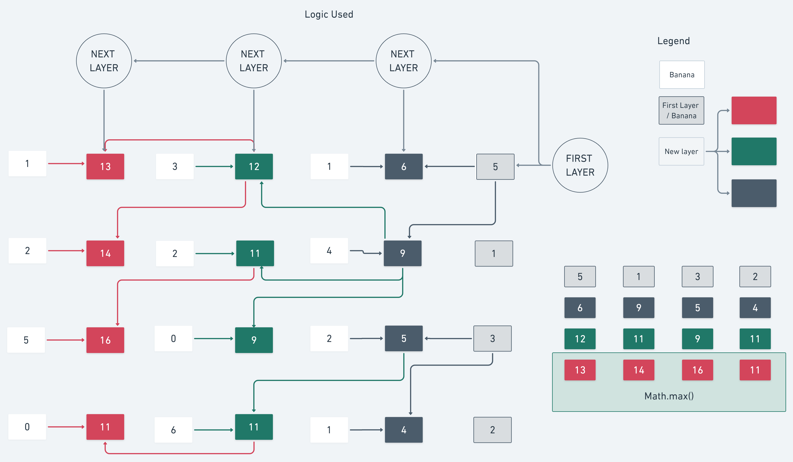

# Algorithm - Looking for Bananas


## Explanation

Given a Jungle in the middle of an island of n*m dimensions. Each field in this jungle contains a positive integer which is the amount of bananas that exist in that field. Initially, the monkey is at the first
column but can be at any row. 

The monkey can move only (right->, right up /, right down\) from a given
cell. Find out the maximum amount of bananas they can collect.

```
Input/Output Examples:

Input :​ mat[][] = {{1, 3, 3},{2, 1, 4},{0, 6, 4}};
Output ​: 12
{(1,0)->(2,1)->(2,2)}

Input: ​mat[][] = { {1, 3, 1, 5},{2, 2, 4, 1},{5, 0, 2, 3},{0, 6, 1, 2}};
Output:​ 16
(2,0) -> (1,1) -> (1,2) -> (0,3) OR (2,0) -> (3,1) -> (2,2) -> (2,3)

Input:​ mat[][] = {{10, 33, 13, 15},
{22, 21, 04, 1},
{5, 0, 2, 3},
{0, 6, 14, 2}};
Output: ​83
```

## Logic
<p align="center">
  
</p>

## Code
### Input
```
const array = [
  [1, 3, 3],
  [2, 1, 4],
  [0, 6, 4],
];

const array2 = [
  [1, 3, 1, 5],
  [2, 2, 4, 1],
  [5, 0, 2, 3],
  [0, 6, 1, 2],
];

const array3 = [
  [10, 33, 13, 15],
  [22, 21, 04, 1],
  [5, 0, 2, 3],
  [0, 6, 14, 2],
];
```
### Function to solve
```javascript
function getMaxBananas(array) {
  let layer = new Array(array[0].length).fill(0);
  for (let col = array.length - 1; col >= 0; col--) {
    const nextLayer = [];
    for (let row = 0; row < array[0].length; row++) {
      nextLayer[row] =
        array[row][col] +
        Math.max(layer[row - 1] || 0, layer[row], layer[row + 1] || 0);
    }
    layer = nextLayer;
  }
  console.log(Math.max(...layer));
}
```
### Call function
You can use any square matrix;

```
getMaxBananas(array);
```


